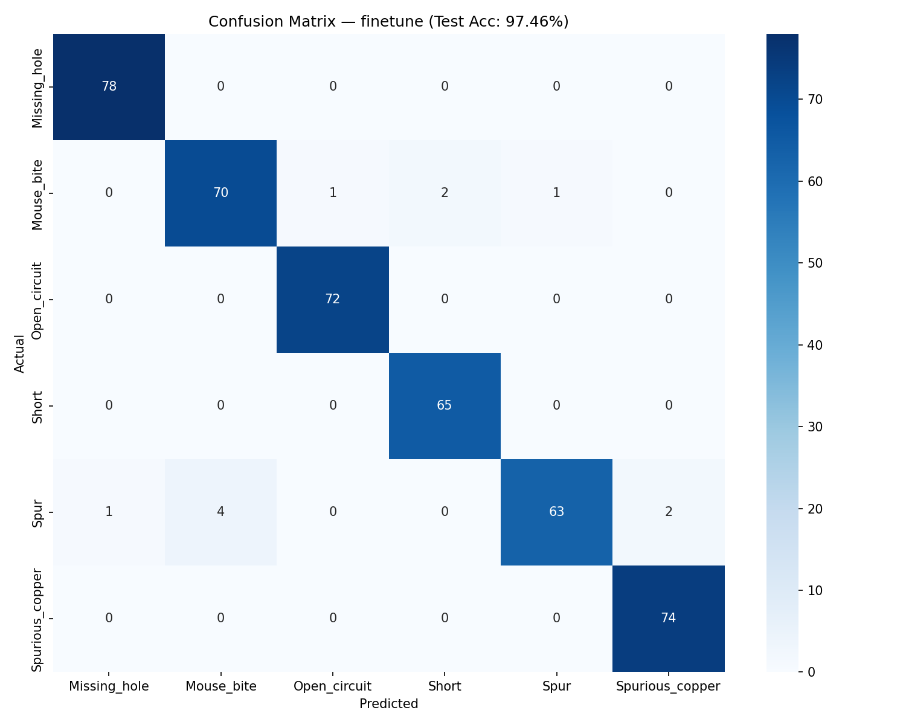

# Defect Classifier — ResNet18 Transfer Learning


Classifying PCB manufacturing defects using Transfer Learning with ResNet18.
Part of my 25-project AI/ML roadmap — Project 7.

## Problem Statement

PCB (Printed Circuit Board) manufacturing produces defects that must be caught
before products ship. Manual inspection is slow and error-prone. This project
builds an automated defect classifier that identifies 6 defect types from
cropped defect patch images with 97.46% test accuracy.

## Defect Classes

| Class | Description |
|---|---|
| Missing_hole | A hole that should exist is absent |
| Mouse_bite | Small notches on the PCB edge |
| Open_circuit | A break in a copper trace |
| Short | Two traces incorrectly connected |
| Spur | Extra unwanted copper spike |
| Spurious_copper | Copper deposit where none should be |

## Architecture

- **Backbone:** ResNet18 pretrained on ImageNet (frozen except layer4)
- **Head:** Linear(512 → 6) replacing the original Linear(512 → 1000)
- **Mode:** Fine-tuning — layer4 + FC head trained, all other layers frozen
<br>
**Input (224×224×3)**
<br> &darr;
<br>**ResNet18 Backbone** *(frozen: layer1, layer2, layer3)*
<br> &darr;
<br>**layer4** *(unfrozen — retrained for PCB features)*
<br> &darr;
<br>**AdaptiveAvgPool2d** &rarr; *512-dim feature vector*
<br> &darr;
<br>**Linear** *(512 &rarr; 6)*
<br> &darr;
<br>**Predicted Defect Class**
## Key Results

| Mode | Val Accuracy | Test Accuracy |
|---|---|---|
| Feature Extraction | 80.54% | — |
| Fine-tuning | 99.10% | 97.46% |

## Confusion Matrix

<div align="center">
  
</div>

### Per-class Analysis

- **Perfect (100%):** Missing_hole, Open_circuit, Short, Spurious_copper
- **Hardest class:** Spur (91.3%) — visually similar to Mouse_bite and Spurious_copper

## Dataset

- **Source:** HRIPCB Dataset (Kaggle: akhatova/pcb-defects)
- **Preparation:** Defect patches cropped from full PCB board images using XML
  bounding box annotations — not raw board images
- **Split:** 70% train / 15% val / 15% test (split on board images to avoid data leakage)
- **Total crops:** ~2,063 training | ~442 val | ~457 test

## Why Patch Cropping Matters

The raw dataset contains full PCB board images (3000×2000+ pixels) with tiny
defect regions (sometimes 60×50 pixels). Feeding full board images to ResNet18
and resizing to 224×224 shrinks defects to ~5×4 pixels — invisible to the model.

First attempt with full images: **18% accuracy** (random guessing).
After cropping defect patches using bounding box annotations: **97.46% accuracy**.

Same model. Same hyperparameters. Data preparation made all the difference.

## Project Structure
```text
defect-classifier-resnet/
├── src/
│   ├── explore_resnet.py       # Architecture exploration and parameter counting
│   ├── prepare_dataset.py      # Crop defect patches from XML annotations
│   ├── dataset.py              # Transforms pipeline and DataLoaders
│   ├── model.py                # ResNet18 with replaceable FC head
│   ├── train.py                # Training loop with best model checkpoint saving
│   └── evaluate.py             # Confusion matrix and per-class accuracy
├── notebooks/
│   └── training_experimentation.ipynb  # Full Colab training notebook
├── confusion_matrix_finetune.png
└── README.md
```
## How to Run

### 1. Clone and setup
```bash
git clone https://github.com/samy1406/defect-classifier-resnet.git
cd defect-classifier-resnet
pip install torch torchvision scikit-learn seaborn matplotlib pillow
```

### 2. Download dataset
```bash
pip install kaggle
kaggle datasets download -d akhatova/pcb-defects -p raw_data/ --unzip
```

### 3. Prepare dataset (crop defect patches)
```bash
python src/prepare_dataset.py
```

### 4. Train

For GPU training, use Google Colab — clone the repo there and run:
```bash
# Feature extraction mode (only FC head trains)
# edit train.py last line: mode="feature_extract", lr=1e-3
python src/train.py

# Fine-tuning mode (layer4 + FC head train)
# edit train.py last line: mode="finetune", lr=1e-4
python src/train.py
```

### 5. Evaluate
```bash
python -m src.evaluate
```

## Training Details

| Parameter | Feature Extract | Fine-tune |
|---|---|---|
| Optimizer | Adam | Adam |
| Learning Rate | 1e-3 | 1e-4 |
| Epochs | 10 | 10 |
| Batch Size | 32 | 32 |
| Frozen Layers | All except FC | layer1, layer2, layer3 |
| Trainable Params | 3,078 | 8,396,806 |

## What I Learned

1. **Data quality beats model complexity** — switching from full board images to
   cropped defect patches jumped accuracy from 18% to 97.46% with zero model changes.

2. **Fine-tuning vs feature extraction** — unfreezing layer4 gave +17% accuracy
   because layer4 learns task-specific features that needed retraining on PCB defects.
   ImageNet features in layer4 (object-level semantics) don't transfer well to
   microscopic PCB defects.

3. **Residual connections solve vanishing gradients** — skip connections let
   gradients flow directly through the network: output = F(x) + x. This enables
   training of very deep networks that would otherwise fail to converge.

4. **Downsample blocks are for shape matching, not feature learning** — the
   1×1 conv in downsample exists purely to match channel dimensions for the
   residual addition when channels double (64→128, 128→256, 256→512).

5. **Data leakage via crops** — splitting on board images (not individual crops)
   ensures the same physical board never appears in both train and test sets.
   Splitting on crops would inflate test accuracy artificially.

6. **Confusion matrix over accuracy** — Spur class at 91.3% was hidden by 97.46%
   overall accuracy. The confusion matrix revealed Spur is visually ambiguous with
   Mouse_bite and Spurious_copper — actionable insight that accuracy alone never gives.

7. **Best model saving over last epoch** — fine-tuning showed overfitting signs
   after epoch 6 (train ~100%, val declining). Saving the best val checkpoint
   rather than the final epoch gave honest generalization performance.

## Future Work

- Add **Grad-CAM visualization** to see which image regions the model focuses on
- Try unfreezing **layer3 + layer4** for deeper fine-tuning
- Export to **ONNX → TensorRT** and benchmark inference speed (connects to Project 25)
- Build a **FastAPI endpoint** that accepts an image and returns defect class + confidence
- Test on **real-world PCB images** outside the HRIPCB dataset

## References

- [Deep Residual Learning for Image Recognition — He et al. 2015](https://arxiv.org/abs/1512.03385)
- [HRIPCB Dataset — Kaggle](https://www.kaggle.com/datasets/akhatova/pcb-defects)
- [PyTorch Transfer Learning Tutorial](https://pytorch.org/tutorials/beginner/transfer_learning_tutorial.html)